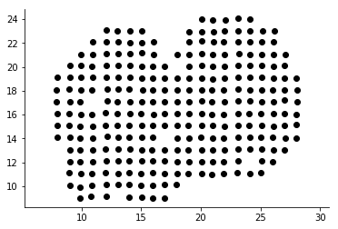
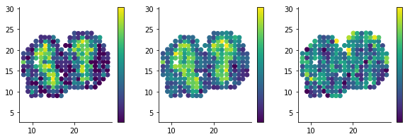
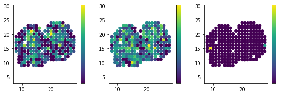
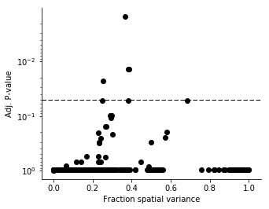

SpatialDE
=========

SpatialDE is a method to identify genes which signfificantly depend on
spatial coordinates in non-linear and non-parametric ways. The intended
applications are spatially resolved RNA-sequencing from e.g. Spatial
Transcriptomics, or *in situ* gene expression measurements from e.g.
SeqFISH or MERFISH.

This repository contains both the implementations of our method, as well
as case studies in applying it.

The key features of our method are

-  Unsupervised - No need to define spatial regions
-  Non-parametric and non-linear expression patterns
-  Extremely fast - Transcriptome wide tests takes only a few minutes on
   normal computers

The primary implementation is as a Python3 package, and can be installed
from the command line by

::

    $ pip install spatialde

To see usage example of SpatialDE either keep reading, or look in the
``Analysis`` directory. Here is brief description of the examples
provided:

-  ``BreastCancer`` - Transcriptome wide study on breast cancer tissue
   from Spatial Transcriptomics.
-  ``Frog`` - A time course of RNA-seq ("1-d space") of *Xenopus*
   development.
-  ``MERFISH`` - Expression from single cells in a region of an
   osteoblast culture using the MERFISH technology with 140 probes.
-  ``MouseOB`` - Spatial Transcriptomics assay of a slice of Mouse
   Olfactory Bulb. (Also see below).
-  ``SeqFISH`` - Expression counts of single cells from mouse
   hippocampus using the SeqFISH technology with 249 probes.

Below follows a typical usage example in interactive form.

.. code:: ipython3

    %pylab inline
    import pandas as pd
    
    rcParams['axes.spines.right'] = False
    rcParams['axes.spines.top'] = False
    
    import NaiveDE
    import SpatialDE

.. parsed-literal::

    Populating the interactive namespace from numpy and matplotlib

As an example, let us look at spatially dependent gene expression in
Mouse Olfactory Bulb using a data set published in Stahl et al 2016.
With the authors method, hundrads of locations on a tissue slice can be
sampled at once, and gene expression is measured by sequencing in an
unbiased while-transcriptome manner.

.. code:: ipython3

    counts = pd.read_csv('Analysis/MouseOB/data/Rep11_MOB_0.csv', index_col=0)
    counts = counts.T[counts.sum(0) >= 3].T  # Filter practically unobserved genes
    
    print(counts.shape)
    counts.iloc[:5, :5]

.. parsed-literal::

    (262, 14859)

.. raw:: html

    

    <table border="1" class="dataframe">
      <thead>
        <tr style="text-align: right;">
          <th></th>
          <th>Nrf1</th>
          <th>Zbtb5</th>
          <th>Ccnl1</th>
          <th>Lrrfip1</th>
          <th>Bbs1</th>
        </tr>
      </thead>
      <tbody>
        <tr>
          <th>16.92x9.015</th>
          <td>1</td>
          <td>1</td>
          <td>1</td>
          <td>2</td>
          <td>1</td>
        </tr>
        <tr>
          <th>16.945x11.075</th>
          <td>0</td>
          <td>0</td>
          <td>3</td>
          <td>2</td>
          <td>2</td>
        </tr>
        <tr>
          <th>16.97x10.118</th>
          <td>0</td>
          <td>1</td>
          <td>1</td>
          <td>0</td>
          <td>0</td>
        </tr>
        <tr>
          <th>16.939x12.132</th>
          <td>1</td>
          <td>0</td>
          <td>1</td>
          <td>0</td>
          <td>4</td>
        </tr>
        <tr>
          <th>16.949x13.055</th>
          <td>0</td>
          <td>0</td>
          <td>0</td>
          <td>3</td>
          <td>0</td>
        </tr>
      </tbody>
    </table>
    

.. code:: ipython3

    sample_info = pd.read_csv('Analysis/MouseOB/MOB_sample_info.csv', index_col=0)
    counts = counts.loc[sample_info.index]  # Align count matrix with metadata table
    
    sample_info.head(5)

.. raw:: html

    

    <table border="1" class="dataframe">
      <thead>
        <tr style="text-align: right;">
          <th></th>
          <th>x</th>
          <th>y</th>
          <th>total_counts</th>
        </tr>
      </thead>
      <tbody>
        <tr>
          <th>16.92x9.015</th>
          <td>16.920</td>
          <td>9.015</td>
          <td>18790</td>
        </tr>
        <tr>
          <th>16.945x11.075</th>
          <td>16.945</td>
          <td>11.075</td>
          <td>36990</td>
        </tr>
        <tr>
          <th>16.97x10.118</th>
          <td>16.970</td>
          <td>10.118</td>
          <td>12471</td>
        </tr>
        <tr>
          <th>16.939x12.132</th>
          <td>16.939</td>
          <td>12.132</td>
          <td>22703</td>
        </tr>
        <tr>
          <th>16.949x13.055</th>
          <td>16.949</td>
          <td>13.055</td>
          <td>18641</td>
        </tr>
      </tbody>
    </table>
    

We can plot the x and y coordinates in the sample info table to see
which locations of the tissue slice has been sampled.

.. code:: ipython3

    figsize(6, 4)
    plt.scatter(sample_info['x'], sample_info['y'], c='k');
    plt.axis('equal');

Our method assumes normally distributed noise, but the data we are using
is from expression counts, and empirically seems to follow a negative
binomial distribution. We use technique by Anscombe to approximately
transform the data to normal distributed noise.

Secondly, library size or sequencing depth of the spatial samples will
bias the expression of every gene. We use linear regression to account
for this effect before performing the spatial test.

.. code:: ipython3

    norm_expr = NaiveDE.stabilize(counts.T).T
    resid_expr = NaiveDE.regress_out(sample_info, norm_expr.T, 'np.log(total_counts)').T

For the sake of this example, let's just run the test on 1000 random
genes. This should just take a few seconds. With our very fast
implementation, testing all 14,000 genes takes about 10 minutes.

.. code:: ipython3

    sample_resid_expr = resid_expr.sample(n=1000, axis=1, random_state=1)
    
    X = sample_info[['x', 'y']]
    results = SpatialDE.run(X, sample_resid_expr)

.. parsed-literal::

    INFO:root:Performing DE test
    INFO:root:Pre-calculating USU^T = K's ...
    INFO:root:Done: 0.1s
    INFO:root:Fitting gene models
    INFO:root:Model 1 of 10
    INFO:root:Model 2 of 10                             
    INFO:root:Model 3 of 10                            
    INFO:root:Model 4 of 10                             
    INFO:root:Model 5 of 10                            
    INFO:root:Model 6 of 10                             
    INFO:root:Model 7 of 10                             
    INFO:root:Model 8 of 10                            
    INFO:root:Model 9 of 10                             
    INFO:root:Model 10 of 10                            
                                                        

The result will be a DataFrame with P-values and other relevant values
for each gene.

The most important columns are

-  ``g`` - The name of the gene
-  ``pval`` - The P-value for spatial differential expression
-  ``qval`` - Signifance after correcting for multiple testing
-  ``l`` - A parameter indicating the distance scale a gene changes
   expression over

.. code:: ipython3

    results.head().T

.. raw:: html

    

    <table border="1" class="dataframe">
      <thead>
        <tr style="text-align: right;">
          <th></th>
          <th>0</th>
          <th>1</th>
          <th>2</th>
          <th>3</th>
          <th>4</th>
        </tr>
      </thead>
      <tbody>
        <tr>
          <th>Gower</th>
          <td>0.999295</td>
          <td>0.999295</td>
          <td>0.999295</td>
          <td>0.999295</td>
          <td>0.999295</td>
        </tr>
        <tr>
          <th>M</th>
          <td>4</td>
          <td>4</td>
          <td>4</td>
          <td>4</td>
          <td>4</td>
        </tr>
        <tr>
          <th>g</th>
          <td>2410016O06Rik</td>
          <td>Angel2</td>
          <td>Hes6</td>
          <td>Fam84a</td>
          <td>Aldh3a2</td>
        </tr>
        <tr>
          <th>l</th>
          <td>0.402001</td>
          <td>0.402001</td>
          <td>0.402001</td>
          <td>0.402001</td>
          <td>0.402001</td>
        </tr>
        <tr>
          <th>max_delta</th>
          <td>0.0295523</td>
          <td>0.03714</td>
          <td>0.21691</td>
          <td>0.0352182</td>
          <td>0.98549</td>
        </tr>
        <tr>
          <th>max_ll</th>
          <td>-52.2817</td>
          <td>-113.227</td>
          <td>23.093</td>
          <td>-122.552</td>
          <td>-73.012</td>
        </tr>
        <tr>
          <th>max_mu_hat</th>
          <td>-0.826809</td>
          <td>-1.20788</td>
          <td>0.140246</td>
          <td>-4.60602</td>
          <td>-1.72603</td>
        </tr>
        <tr>
          <th>max_s2_t_hat</th>
          <td>0.650257</td>
          <td>1.33346</td>
          <td>0.0544851</td>
          <td>17.5935</td>
          <td>1.4265</td>
        </tr>
        <tr>
          <th>model</th>
          <td>SE</td>
          <td>SE</td>
          <td>SE</td>
          <td>SE</td>
          <td>SE</td>
        </tr>
        <tr>
          <th>n</th>
          <td>260</td>
          <td>260</td>
          <td>260</td>
          <td>260</td>
          <td>260</td>
        </tr>
        <tr>
          <th>time</th>
          <td>0.00247407</td>
          <td>0.000535011</td>
          <td>0.000555038</td>
          <td>0.000602961</td>
          <td>0.00033164</td>
        </tr>
        <tr>
          <th>BIC</th>
          <td>126.806</td>
          <td>248.696</td>
          <td>-23.9433</td>
          <td>267.346</td>
          <td>168.267</td>
        </tr>
        <tr>
          <th>max_ll_null</th>
          <td>-53.706</td>
          <td>-114.128</td>
          <td>22.7789</td>
          <td>-123.262</td>
          <td>-73.1737</td>
        </tr>
        <tr>
          <th>LLR</th>
          <td>1.42435</td>
          <td>0.901583</td>
          <td>0.314117</td>
          <td>0.710778</td>
          <td>0.161672</td>
        </tr>
        <tr>
          <th>fraction_spatial_variance</th>
          <td>0.971276</td>
          <td>0.964166</td>
          <td>0.82165</td>
          <td>0.965957</td>
          <td>0.503478</td>
        </tr>
        <tr>
          <th>pval</th>
          <td>0.232689</td>
          <td>0.342358</td>
          <td>0.575165</td>
          <td>0.399186</td>
          <td>0.687622</td>
        </tr>
        <tr>
          <th>qval</th>
          <td>0.980077</td>
          <td>0.980077</td>
          <td>0.980077</td>
          <td>0.980077</td>
          <td>0.980077</td>
        </tr>
      </tbody>
    </table>
    

.. code:: ipython3

    results.sort_values('qval').head(10)[['g', 'l', 'qval']]

.. raw:: html

    

    <table border="1" class="dataframe">
      <thead>
        <tr style="text-align: right;">
          <th></th>
          <th>g</th>
          <th>l</th>
          <th>qval</th>
        </tr>
      </thead>
      <tbody>
        <tr>
          <th>892</th>
          <td>Kcnh3</td>
          <td>1.907609</td>
          <td>0.001512</td>
        </tr>
        <tr>
          <th>739</th>
          <td>Pcp4</td>
          <td>1.135190</td>
          <td>0.013843</td>
        </tr>
        <tr>
          <th>517</th>
          <td>Igfbp2</td>
          <td>1.135190</td>
          <td>0.013843</td>
        </tr>
        <tr>
          <th>800</th>
          <td>Gng13</td>
          <td>1.907609</td>
          <td>0.022632</td>
        </tr>
        <tr>
          <th>262</th>
          <td>Naaa</td>
          <td>0.675535</td>
          <td>0.051705</td>
        </tr>
        <tr>
          <th>827</th>
          <td>Gng4</td>
          <td>1.907609</td>
          <td>0.051705</td>
        </tr>
        <tr>
          <th>587</th>
          <td>Map1b</td>
          <td>1.135190</td>
          <td>0.051705</td>
        </tr>
        <tr>
          <th>459</th>
          <td>Fmo1</td>
          <td>1.135190</td>
          <td>0.096710</td>
        </tr>
        <tr>
          <th>356</th>
          <td>Slc38a3</td>
          <td>1.135190</td>
          <td>0.096710</td>
        </tr>
        <tr>
          <th>344</th>
          <td>Hpcal4</td>
          <td>1.135190</td>
          <td>0.107360</td>
        </tr>
      </tbody>
    </table>
    

We detected a few spatially differentially expressed genes, *Cck* and
*Ptn* for example.

A simple way to visualize these genes is by plotting the x and y
coordinates as above, but letting the color correspond to expression
level.

.. code:: ipython3

    figsize(10, 3)
    for i, g in enumerate(['Kcnh3', 'Pcp4', 'Igfbp2']):
        plt.subplot(1, 3, i + 1)
        plt.scatter(sample_info['x'], sample_info['y'], c=norm_expr[g]);
        plt.axis('equal')
    
        
        plt.colorbar(ticks=[]);

For reference, we can compare these to genes which are not spatially DE

.. code:: ipython3

    results.sort_values('qval').tail(10)[['g', 'l', 'qval']]

.. raw:: html

    

    <table border="1" class="dataframe">
      <thead>
        <tr style="text-align: right;">
          <th></th>
          <th>g</th>
          <th>l</th>
          <th>qval</th>
        </tr>
      </thead>
      <tbody>
        <tr>
          <th>338</th>
          <td>Myo9b</td>
          <td>1.135190</td>
          <td>0.980077</td>
        </tr>
        <tr>
          <th>336</th>
          <td>Sc4mol</td>
          <td>1.135190</td>
          <td>0.980077</td>
        </tr>
        <tr>
          <th>335</th>
          <td>Phf11b</td>
          <td>1.135190</td>
          <td>0.980077</td>
        </tr>
        <tr>
          <th>334</th>
          <td>Cytip</td>
          <td>1.135190</td>
          <td>0.980077</td>
        </tr>
        <tr>
          <th>333</th>
          <td>Bbs12</td>
          <td>1.135190</td>
          <td>0.980077</td>
        </tr>
        <tr>
          <th>337</th>
          <td>Dnase2a</td>
          <td>1.135190</td>
          <td>0.980077</td>
        </tr>
        <tr>
          <th>525</th>
          <td>Foxc1</td>
          <td>1.135190</td>
          <td>0.980448</td>
        </tr>
        <tr>
          <th>659</th>
          <td>BC068281</td>
          <td>1.135190</td>
          <td>0.981408</td>
        </tr>
        <tr>
          <th>880</th>
          <td>Olfr1204</td>
          <td>1.907609</td>
          <td>1.000000</td>
        </tr>
        <tr>
          <th>638</th>
          <td>Rspo1</td>
          <td>1.135190</td>
          <td>1.000000</td>
        </tr>
      </tbody>
    </table>
    

.. code:: ipython3

    figsize(10, 3)
    for i, g in enumerate(['Myo9b', 'Sc4mol', 'Phf11b']):
        plt.subplot(1, 3, i + 1)
        plt.scatter(sample_info['x'], sample_info['y'], c=norm_expr[g]);
        plt.axis('equal')
    
        
        plt.colorbar(ticks=[]);

In regular differential expression analysis, we usually investigate the
relation between significance and effect size by so called *volcano
plots*. We don't have the concept of fold change in our case, but we can
investigate the fraction of variance explained by spatial variation.

.. code:: ipython3

    figsize(5, 4)
    plt.yscale('log')
    
    plt.scatter(results['fraction_spatial_variance'], results['qval'], c='black')
    
    plt.axhline(0.05, c='black', lw=1, ls='--');
    
    plt.gca().invert_yaxis();
    plt.xlabel('Fraction spatial variance')
    plt.ylabel('Adj. P-value');

