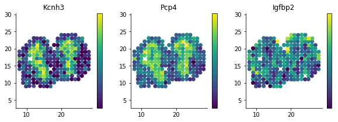
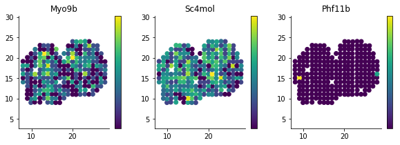
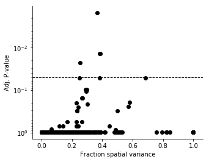
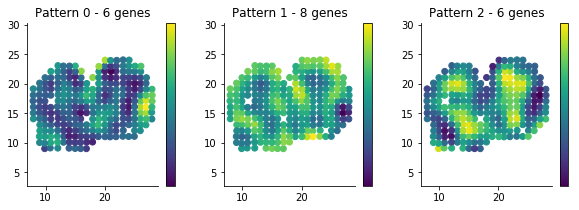

SpatialDE
=========

**SpatialDE** is a method to identify genes which significantly depend
on spatial coordinates in non-linear and non-parametric ways. The
intended applications are spatially resolved RNA-sequencing from e.g.
Spatial Transcriptomics, or *in situ* gene expression measurements from
e.g. SeqFISH or MERFISH.

Additionally, SpatialDE provides **automatic expression histology**, a
method that groups genes into common spatial patterns (and conversely
reveal histological patterns based on gene coexpression).

This repository contains both the implementations of our methods, as
well as case studies in applying it.

The key features of our method are

-  Unsupervised - No need to define spatial regions
-  Non-parametric and non-linear expression patterns
-  Automatic histology based on spatially coexpressed genes
-  Extremely fast - Transcriptome wide tests takes only a few minutes on
   normal computers

The primary implementation is as a Python 3 package, and can be
installed from the command line by

::

    $ pip install spatialde

(This should only take a minute or so on a typical system)

To see usage example of SpatialDE either keep reading, or look in the
``Analysis`` directory. The following examples are provided:

-  ``BreastCancer`` - Transcriptome wide study on breast cancer tissue
   from Spatial Transcriptomics.
-  ``Frog`` - A time course of RNA-seq ("1-d space") of *Xenopus*
   development.
-  ``MERFISH`` - Expression from single cells in a region of an
   osteoblast culture using the MERFISH technology with 140 probes.
-  ``MouseOB`` - Spatial Transcriptomics assay of a slice of Mouse
   Olfactory Bulb. (Also see below).
-  ``SeqFISH`` - Expression counts of single cells from mouse
   hippocampus using the SeqFISH technology with 249 probes.

Below follows a typical usage example in interactive form.

SpatialDE significance test example use
---------------------------------------

.. code:: ipython3

    %pylab inline
    import pandas as pd
    
    rcParams['axes.spines.right'] = False
    rcParams['axes.spines.top'] = False
    
    import NaiveDE
    import SpatialDE

.. parsed-literal::

    Populating the interactive namespace from numpy and matplotlib

As an example, let us look at spatially dependent gene expression in
Mouse Olfactory Bulb using a data set published in `Stahl et al
2016 <http://dx.doi.org/10.1126/science.aaf2403>`__. With the authors
method, hundrads of locations on a tissue slice can be sampled at once,
and gene expression is measured by sequencing in an unbiased
whole-transcriptome manner.

.. code:: ipython3

    counts = pd.read_csv('Analysis/MouseOB/data/Rep11_MOB_0.csv', index_col=0)
    counts = counts.T[counts.sum(0) >= 3].T  # Filter practically unobserved genes
    
    print(counts.shape)
    counts.iloc[:5, :5]

.. parsed-literal::

    (262, 14859)

.. raw:: html

    

    
    <table border="1" class="dataframe">
      <thead>
        <tr style="text-align: right;">
          <th></th>
          <th>Nrf1</th>
          <th>Zbtb5</th>
          <th>Ccnl1</th>
          <th>Lrrfip1</th>
          <th>Bbs1</th>
        </tr>
      </thead>
      <tbody>
        <tr>
          <th>16.92x9.015</th>
          <td>1</td>
          <td>1</td>
          <td>1</td>
          <td>2</td>
          <td>1</td>
        </tr>
        <tr>
          <th>16.945x11.075</th>
          <td>0</td>
          <td>0</td>
          <td>3</td>
          <td>2</td>
          <td>2</td>
        </tr>
        <tr>
          <th>16.97x10.118</th>
          <td>0</td>
          <td>1</td>
          <td>1</td>
          <td>0</td>
          <td>0</td>
        </tr>
        <tr>
          <th>16.939x12.132</th>
          <td>1</td>
          <td>0</td>
          <td>1</td>
          <td>0</td>
          <td>4</td>
        </tr>
        <tr>
          <th>16.949x13.055</th>
          <td>0</td>
          <td>0</td>
          <td>0</td>
          <td>3</td>
          <td>0</td>
        </tr>
      </tbody>
    </table>
    

.. code:: ipython3

    sample_info = pd.read_csv('Analysis/MouseOB/MOB_sample_info.csv', index_col=0)
    counts = counts.loc[sample_info.index]  # Align count matrix with metadata table
    
    sample_info.head(5)

.. raw:: html

    

    
    <table border="1" class="dataframe">
      <thead>
        <tr style="text-align: right;">
          <th></th>
          <th>x</th>
          <th>y</th>
          <th>total_counts</th>
        </tr>
      </thead>
      <tbody>
        <tr>
          <th>16.92x9.015</th>
          <td>16.920</td>
          <td>9.015</td>
          <td>18790</td>
        </tr>
        <tr>
          <th>16.945x11.075</th>
          <td>16.945</td>
          <td>11.075</td>
          <td>36990</td>
        </tr>
        <tr>
          <th>16.97x10.118</th>
          <td>16.970</td>
          <td>10.118</td>
          <td>12471</td>
        </tr>
        <tr>
          <th>16.939x12.132</th>
          <td>16.939</td>
          <td>12.132</td>
          <td>22703</td>
        </tr>
        <tr>
          <th>16.949x13.055</th>
          <td>16.949</td>
          <td>13.055</td>
          <td>18641</td>
        </tr>
      </tbody>
    </table>
    

We can plot the x and y coordinates in the sample info table to see
which locations of the tissue slice has been sampled.

.. code:: ipython3

    figsize(6, 4)
    plt.scatter(sample_info['x'], sample_info['y'], c='k');
    plt.axis('equal');

Our method assumes normally distributed noise, but the data we are using
is from expression counts, and empirically seems to follow a negative
binomial distribution. We use technique by Anscombe to approximately
transform the data to normal distributed noise.

Secondly, library size or sequencing depth of the spatial samples will
bias the expression of every gene. We use linear regression to account
for this effect before performing the spatial test.

.. code:: ipython3

    norm_expr = NaiveDE.stabilize(counts.T).T
    resid_expr = NaiveDE.regress_out(sample_info, norm_expr.T, 'np.log(total_counts)').T

For the sake of this example, let's just run the test on 1000 random
genes. This should just take a few seconds. With our very fast
implementation, testing all 14,000 genes takes about 10 minutes.

.. code:: ipython3

    sample_resid_expr = resid_expr.sample(n=1000, axis=1, random_state=1)
    
    X = sample_info[['x', 'y']]
    results = SpatialDE.run(X, sample_resid_expr)

.. parsed-literal::

    INFO:root:Performing DE test
    INFO:root:Pre-calculating USU^T = K's ...
    INFO:root:Done: 0.11s
    INFO:root:Fitting gene models
    INFO:root:Model 1 of 10
    INFO:root:Model 2 of 10                            
    INFO:root:Model 3 of 10                            
    INFO:root:Model 4 of 10                            
    INFO:root:Model 5 of 10                            
    INFO:root:Model 6 of 10                            
    INFO:root:Model 7 of 10                            
    INFO:root:Model 8 of 10                            
    INFO:root:Model 9 of 10                            
    INFO:root:Model 10 of 10                           
                                                       

The result will be a ``DataFrame`` with P-values and other relevant
values for each gene.

The most important columns are

-  ``g`` - The name of the gene
-  ``pval`` - The P-value for spatial differential expression
-  ``qval`` - Signifance after correcting for multiple testing
-  ``l`` - A parameter indicating the distance scale a gene changes
   expression over

.. code:: ipython3

    results.head().T

.. raw:: html

    

    
    <table border="1" class="dataframe">
      <thead>
        <tr style="text-align: right;">
          <th></th>
          <th>0</th>
          <th>1</th>
          <th>2</th>
          <th>3</th>
          <th>4</th>
        </tr>
      </thead>
      <tbody>
        <tr>
          <th>FSV</th>
          <td>0.999955</td>
          <td>2.0597e-09</td>
          <td>2.0597e-09</td>
          <td>2.0597e-09</td>
          <td>2.0597e-09</td>
        </tr>
        <tr>
          <th>M</th>
          <td>4</td>
          <td>4</td>
          <td>4</td>
          <td>4</td>
          <td>4</td>
        </tr>
        <tr>
          <th>g</th>
          <td>2410016O06Rik</td>
          <td>Arpp19</td>
          <td>Srsf7</td>
          <td>Wbp7</td>
          <td>Cpsf3l</td>
        </tr>
        <tr>
          <th>l</th>
          <td>0.402001</td>
          <td>0.402001</td>
          <td>0.402001</td>
          <td>0.402001</td>
          <td>0.402001</td>
        </tr>
        <tr>
          <th>max_delta</th>
          <td>4.53999e-05</td>
          <td>4.85165e+08</td>
          <td>4.85165e+08</td>
          <td>4.85165e+08</td>
          <td>4.85165e+08</td>
        </tr>
        <tr>
          <th>max_ll</th>
          <td>-52.2589</td>
          <td>-107.685</td>
          <td>-114.477</td>
          <td>-112.664</td>
          <td>-49.1672</td>
        </tr>
        <tr>
          <th>max_mu_hat</th>
          <td>-0.826851</td>
          <td>-2.21845</td>
          <td>-6.67811</td>
          <td>-2.25044</td>
          <td>0.146089</td>
        </tr>
        <tr>
          <th>max_s2_t_hat</th>
          <td>0.666985</td>
          <td>1.04203e-08</td>
          <td>9.22126e-08</td>
          <td>1.07257e-08</td>
          <td>2.20142e-10</td>
        </tr>
        <tr>
          <th>model</th>
          <td>SE</td>
          <td>SE</td>
          <td>SE</td>
          <td>SE</td>
          <td>SE</td>
        </tr>
        <tr>
          <th>n</th>
          <td>260</td>
          <td>260</td>
          <td>260</td>
          <td>260</td>
          <td>260</td>
        </tr>
        <tr>
          <th>s2_FSV</th>
          <td>1.94342</td>
          <td>0.253788</td>
          <td>47.2945</td>
          <td>0.363388</td>
          <td>4.48293</td>
        </tr>
        <tr>
          <th>s2_logdelta</th>
          <td>6.81931e+08</td>
          <td>4.3315e+16</td>
          <td>8.07194e+18</td>
          <td>6.20209e+16</td>
          <td>7.65119e+17</td>
        </tr>
        <tr>
          <th>time</th>
          <td>0.00134182</td>
          <td>0.00104499</td>
          <td>0.000994921</td>
          <td>0.000999928</td>
          <td>0.00106692</td>
        </tr>
        <tr>
          <th>BIC</th>
          <td>126.761</td>
          <td>237.613</td>
          <td>251.196</td>
          <td>247.571</td>
          <td>120.577</td>
        </tr>
        <tr>
          <th>max_ll_null</th>
          <td>-53.706</td>
          <td>-107.686</td>
          <td>-114.478</td>
          <td>-112.665</td>
          <td>-49.1681</td>
        </tr>
        <tr>
          <th>LLR</th>
          <td>1.44715</td>
          <td>0.000964007</td>
          <td>0.000964011</td>
          <td>0.000964007</td>
          <td>0.00096401</td>
        </tr>
        <tr>
          <th>pval</th>
          <td>0.228986</td>
          <td>0.975231</td>
          <td>0.975231</td>
          <td>0.975231</td>
          <td>0.975231</td>
        </tr>
        <tr>
          <th>qval</th>
          <td>0.975231</td>
          <td>0.975231</td>
          <td>0.975231</td>
          <td>0.975231</td>
          <td>0.975231</td>
        </tr>
      </tbody>
    </table>
    

.. code:: ipython3

    results.sort_values('qval').head(10)[['g', 'l', 'qval']]

.. raw:: html

    

    
    <table border="1" class="dataframe">
      <thead>
        <tr style="text-align: right;">
          <th></th>
          <th>g</th>
          <th>l</th>
          <th>qval</th>
        </tr>
      </thead>
      <tbody>
        <tr>
          <th>890</th>
          <td>Kcnh3</td>
          <td>1.907609</td>
          <td>0.001512</td>
        </tr>
        <tr>
          <th>772</th>
          <td>Pcp4</td>
          <td>1.135190</td>
          <td>0.013843</td>
        </tr>
        <tr>
          <th>736</th>
          <td>Igfbp2</td>
          <td>1.135190</td>
          <td>0.013843</td>
        </tr>
        <tr>
          <th>800</th>
          <td>Gng13</td>
          <td>1.907609</td>
          <td>0.022632</td>
        </tr>
        <tr>
          <th>646</th>
          <td>Naaa</td>
          <td>0.675535</td>
          <td>0.051705</td>
        </tr>
        <tr>
          <th>749</th>
          <td>Map1b</td>
          <td>1.135190</td>
          <td>0.051705</td>
        </tr>
        <tr>
          <th>826</th>
          <td>Gng4</td>
          <td>1.907609</td>
          <td>0.051705</td>
        </tr>
        <tr>
          <th>724</th>
          <td>Fmo1</td>
          <td>1.135190</td>
          <td>0.096710</td>
        </tr>
        <tr>
          <th>714</th>
          <td>Slc38a3</td>
          <td>1.135190</td>
          <td>0.096710</td>
        </tr>
        <tr>
          <th>712</th>
          <td>Hpcal4</td>
          <td>1.135190</td>
          <td>0.107360</td>
        </tr>
      </tbody>
    </table>
    

We detected a few spatially differentially expressed genes, *Cck* and
*Ptn* for example.

A simple way to visualize these genes is by plotting the x and y
coordinates as above, but letting the color correspond to expression
level.

.. code:: ipython3

    figsize(10, 3)
    for i, g in enumerate(['Kcnh3', 'Pcp4', 'Igfbp2']):
        plt.subplot(1, 3, i + 1)
        plt.scatter(sample_info['x'], sample_info['y'], c=norm_expr[g]);
        plt.title(g)
        plt.axis('equal')
    
        
        plt.colorbar(ticks=[]);

For reference, we can compare these to genes which are not spatially DE

.. code:: ipython3

    results.sort_values('qval').tail(10)[['g', 'l', 'qval']]

.. raw:: html

    

    
    <table border="1" class="dataframe">
      <thead>
        <tr style="text-align: right;">
          <th></th>
          <th>g</th>
          <th>l</th>
          <th>qval</th>
        </tr>
      </thead>
      <tbody>
        <tr>
          <th>334</th>
          <td>Tmem70</td>
          <td>0.402001</td>
          <td>0.975231</td>
        </tr>
        <tr>
          <th>335</th>
          <td>Rnf20</td>
          <td>0.402001</td>
          <td>0.975231</td>
        </tr>
        <tr>
          <th>336</th>
          <td>Zfp85-rs1</td>
          <td>0.402001</td>
          <td>0.975231</td>
        </tr>
        <tr>
          <th>337</th>
          <td>C1qtnf7</td>
          <td>0.402001</td>
          <td>0.975231</td>
        </tr>
        <tr>
          <th>338</th>
          <td>Ap4b1</td>
          <td>0.402001</td>
          <td>0.975231</td>
        </tr>
        <tr>
          <th>339</th>
          <td>Psma4</td>
          <td>0.402001</td>
          <td>0.975231</td>
        </tr>
        <tr>
          <th>340</th>
          <td>Aldh3b1</td>
          <td>0.402001</td>
          <td>0.975231</td>
        </tr>
        <tr>
          <th>341</th>
          <td>Hdx</td>
          <td>0.402001</td>
          <td>0.975231</td>
        </tr>
        <tr>
          <th>328</th>
          <td>Zfp113</td>
          <td>0.402001</td>
          <td>0.975231</td>
        </tr>
        <tr>
          <th>999</th>
          <td>Preb</td>
          <td>9.052138</td>
          <td>0.975231</td>
        </tr>
      </tbody>
    </table>
    

.. code:: ipython3

    figsize(10, 3)
    for i, g in enumerate(['Myo9b', 'Sc4mol', 'Phf11b']):
        plt.subplot(1, 3, i + 1)
        plt.scatter(sample_info['x'], sample_info['y'], c=norm_expr[g]);
        plt.title(g)
        plt.axis('equal')
    
        
        plt.colorbar(ticks=[]);

In regular differential expression analysis, we usually investigate the
relation between significance and effect size by so called *volcano
plots*. We don't have the concept of fold change in our case, but we can
investigate the fraction of variance explained by spatial variation.

.. code:: ipython3

    figsize(5, 4)
    plt.yscale('log')
    
    plt.scatter(results['FSV'], results['qval'], c='black')
    
    plt.axhline(0.05, c='black', lw=1, ls='--');
    
    plt.gca().invert_yaxis();
    plt.xlabel('Fraction spatial variance')
    plt.ylabel('Adj. P-value');

Automatic expression histology
------------------------------

To perform automatic expression histology (AEH), the genes should be
filtered by SpatialDE significance. For this example, let us use a very
weak threshold. But in typical use, filter by ``qval < 0.05``

.. code:: ipython3

    sign_results = results.query('qval < 0.5')

AEH requires two parameters: the number of patterns, and the
characteristic lengthscale for histological patterns.

For some guidance in picking the lengthscale ``l`` we can look at the
optimal lengthscale for the signficant genes.

.. code:: ipython3

    sign_results['l'].value_counts()

.. parsed-literal::

    1.135190    11
    1.907609     4
    0.675535     4
    3.205604     1
    Name: l, dtype: int64

Here we see that the lengthscale on average is ~1.5, to use some extra
spatial covariance, we put this paramater to ``l = 1.8``.

For the number of patterns, we try ``C = 3``.

.. code:: ipython3

    histology_results, patterns = SpatialDE.aeh.spatial_patterns(X, resid_expr, sign_results, C=3, l=1.8, verbosity=1)

.. parsed-literal::

    iter 0, ELBO: -9.48e+08
    iter 1, ELBO: -4.20e+08, delta_ELBO: 5.28e+08
    iter 2, ELBO: -4.20e+08, delta_ELBO: 7.63e+02
    iter 3, ELBO: -4.20e+08, delta_ELBO: 2.07e+02
    iter 4, ELBO: -4.20e+08, delta_ELBO: 8.03e+01
    iter 5, ELBO: -4.20e+08, delta_ELBO: 3.40e+00
    iter 6, ELBO: -4.20e+08, delta_ELBO: 6.62e-02
    iter 7, ELBO: -4.20e+08, delta_ELBO: 2.75e-03
    iter 8, ELBO: -4.20e+08, delta_ELBO: 3.96e-03
    iter 9, ELBO: -4.20e+08, delta_ELBO: 7.49e-05
    Converged on iter 9

After fitting the AEH model, the function returns two ``DataFrame``\ s,
one with pattern membership information for each gene:

.. code:: ipython3

    histology_results.head()

.. raw:: html

    

    
    <table border="1" class="dataframe">
      <thead>
        <tr style="text-align: right;">
          <th></th>
          <th>g</th>
          <th>membership</th>
          <th>pattern</th>
        </tr>
      </thead>
      <tbody>
        <tr>
          <th>564</th>
          <td>AI593442</td>
          <td>1.0</td>
          <td>1</td>
        </tr>
        <tr>
          <th>619</th>
          <td>Arhgef9</td>
          <td>1.0</td>
          <td>1</td>
        </tr>
        <tr>
          <th>632</th>
          <td>6330403K07Rik</td>
          <td>1.0</td>
          <td>1</td>
        </tr>
        <tr>
          <th>646</th>
          <td>Naaa</td>
          <td>1.0</td>
          <td>0</td>
        </tr>
        <tr>
          <th>712</th>
          <td>Hpcal4</td>
          <td>1.0</td>
          <td>2</td>
        </tr>
      </tbody>
    </table>
    

And one with realizations for the underlying expression for each
histological pattern.

We can visualize this underlying expression in the tissue context as we
would for any individual gene.

.. code:: ipython3

    figsize(10, 3)
    for i in range(3):
        plt.subplot(1, 3, i + 1)
        plt.scatter(sample_info['x'], sample_info['y'], c=patterns[i]);
        plt.axis('equal')
        plt.title('Pattern {} - {} genes'.format(i, histology_results.query('pattern == @i').shape[0] ))
        plt.colorbar(ticks=[]);

It is usually interesting to see what the coexpressed genes determining
a histological pattern are:

.. code:: ipython3

    for i in histology_results.sort_values('pattern').pattern.unique():
        
        print('Pattern {}'.format(i))
        print(', '.join(histology_results.query('pattern == @i').sort_values('membership')['g'].tolist()))
        print()

.. parsed-literal::

    Pattern 0
    Naaa, Aebp1, Mfap3l, Fmo1, 2810002D19Rik, Gng13
    
    Pattern 1
    Map2, Arhgef9, AI593442, 6330403K07Rik, Slc38a3, Igfbp2, Nmb, Map1b
    
    Pattern 2
    Hpcal4, Snap25, Pcp4, Gng4, Ppfia2, Kcnh3
    

